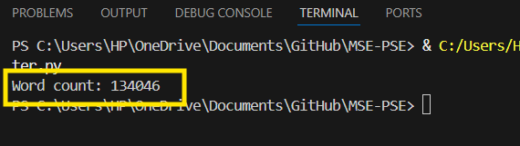

# Output Screenshot

This output is generated from the Python file: `file_word_counter.py`.

The screenshot above shows the terminal output for the word count operation, with a result of 134,046 words.
